# LTE-Mリーフ 利用ガイド
本ページは KDDI社製 LTE-Mリーフのサポートページです

初版 2021/1/15 (STM32 core with LPWA 1.9.1-Relase1対応)  
２版 2021/2/1 (STM32 core with LPWA 1.9.1-Relase2対応)  

-- 改訂履歴--  
https://github.com/mi-saitou/LTE-M-Leaf/blob/main/changelog.md  

-- 活用ガイド --  
https://github.com/mi-saitou/LTE-M-Leaf/blob/main/usage.md  


## LTE-M Leaf Ver.3  
このボードはトリリオンノード規格に加えLTE-M,センサー,STM32マイコンを1枚の基板にした開発ボードです  
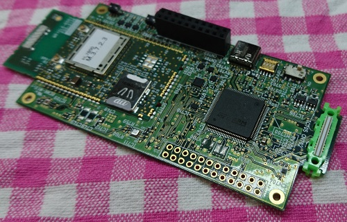

## 利用できる機能
このボードでは次のような機能を使うことができます  
・Arduino IDEによるプログラミング  
　　STM32 core 1.9.0互換  
・LTE-M通信  
　　TCP,UDP,HTTP(S)通信  
・環境センサー(BME280)  
　　温度、湿度、気圧  
・6軸センサー(ICM20602)  
・照度センサー(OPT3001)  
・人感センサー(AK9754)  
　　赤外線焦電センサー    
・leafコネクタ  
　　I2Cx2,UARTx2,ADCx2,PWM, GPIOx20  
・LED(R,G,B各1個)  
・DIPスイッチ  
・押しボタンスイッチ  


## ボード外観
### 表面  
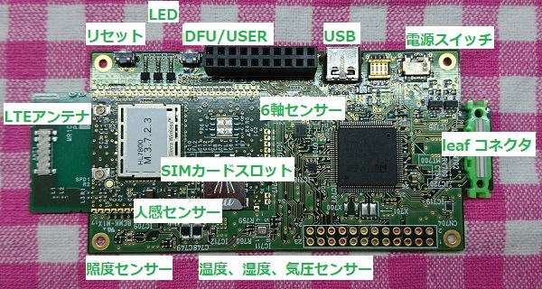

### 裏面  
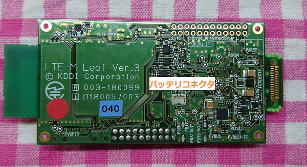

## 開発環境のセットアップ
### Arduino IDE設定
本ページではArudino IDE 1.8.13で動作確認を行っています

＜ご注意＞
もしご利用のArduinoIDEにSTM32がインストールされている場合は予め削除してください  
次項のインストールを行うとSTM32 core 1.9.0相当の機能がインストールされますのでnucleo等のボードはそのままお使い頂けます。

#### ・環境設定にてボードマネージャURLに次の内容を設定します  

```
https://github.com/mi-saitou/LTE-M-Leaf/raw/main/package_stm_index.json
```

#### ・ボードマネージャを起動
検索ボックスに「stm32」と入力  
候補に「STM32 cores with LPWA」が現れたらインストールを行います  

### Arduino 各種設定
#### ・ボード選択  
STM32 board選択にKDDI LPWA deviceが追加されていますのでそれを選択してください  
選択後に自動的に「KDDI LTE-M leaf Ver.3」ボードが選択されが利用できるようになります  
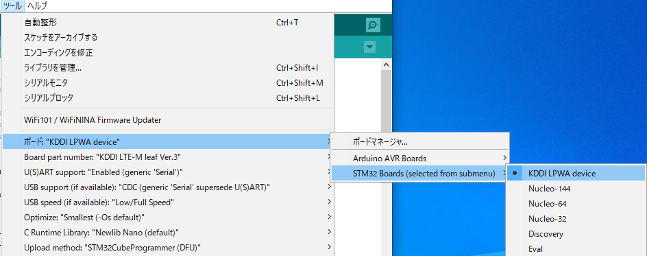

#### ・USB設定  
ご利用になる環境に合わせて選択してください  
「なし」(デフォルト設定)  
　USBデバイスは無効になります  
　ArduinoのSerialはSTM32のLPUART(CN703)に設定されます  
「CDC(generic Serial supersede U(S)ART」  
　ArduinoのSerialはUSBシリアルデバイスに設定されます  
「CDC(no generic Serial)」、「HID(keyboard and mouse)」  
　Arduinoのスケッチでプログラミングすることにより利用可能です  
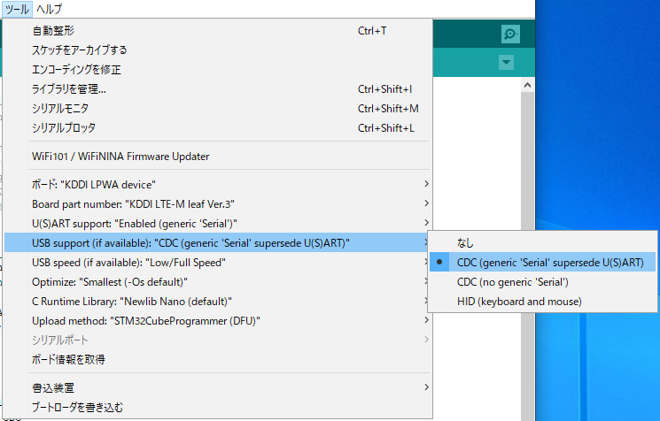


## 電源の入れ方
### USB接続
このボードのUSBコネクタはType-C(2.0互換)です  
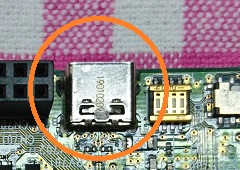


USB Type-Cを搭載したmacbookにおいて接続時にシリアルポートが認識されないという事象が報告されています  
もしそのような状況が出た場合はUSBハブを挟んで接続するようにしてください  

### LiPoバッテリ
次の場所に付属のLiPoバッテリを接続してください  
接続する際は必ず電源スイッチをオフで行うようにしてください  
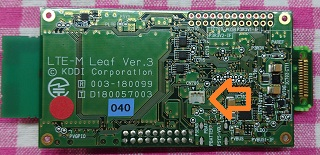

### 電源スイッチ
このボードの電源スイッチです「ON」の位置で電源がオンになります  
またLiPoバッテリの充放電も有効になります  
※OFF状態ではバッテリ充電が行われませんので注意してください  
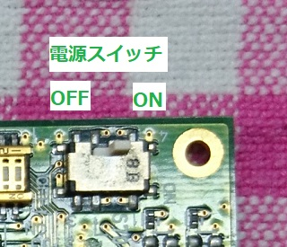


## 書き込みツールのインストール
STM32 Arduinoでボードへの書き込みを行うにはSTM32CubeProgrammerが必要になります  STMicroelectronics のページからインストーラをダウウンロードしインストールしてください  
https://www.st.com/en/development-tools/stm32cubeprog.html

## ボード書き込み方法
写真のようにDFUスイッチを押しながら電源スイッチをONにします  
ArduinoIDEで書き込みを行うと自動的にDFUが解除されスケッチがスタートします  
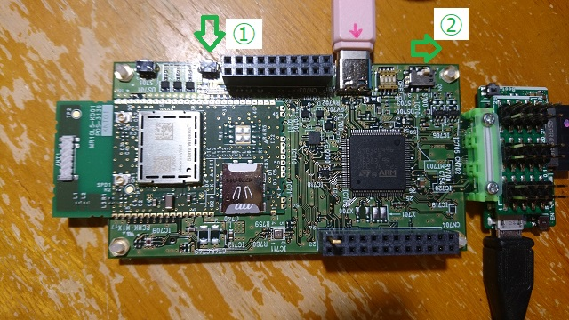

## コネクタピンアサイン
ボード上にある各コネクタのピン配置は次の通りです  
leafコネクタとヘッダコネクタCN704は同じ信号が出ています  
### leafコネクタ(TOP view)
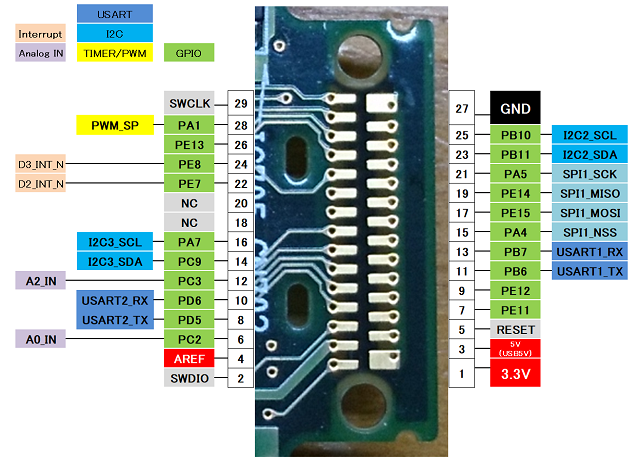

### ヘッダコネクタCN704(TOP view)
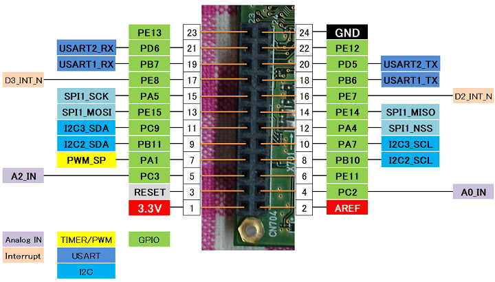

## ハードウェア機能
Arduinoスケッチでハードウェア機能を使う方法は次の通りです  

### LED
ボード上にあるLED(R,G,B各1個)の制御を行うことができます  
```
#include "Lpwa.h"
LpwaCtrl pmctrl;
  pmctrl.setLed(true, false, false); // Red
  pmctrl.setLed(false, true, false); // Green
  pmctrl.setLed(false, false, true); // Brue

  pmctrl.setLed(LED_RED, true); // Red点灯
  pmctrl.setLed(LED_RED, false); // Red消灯
  pmctrl.setLed(LED_GREEN, true); // Green点灯
  pmctrl.setLed(LED_GREEN, false); // Green消灯
  pmctrl.setLed(LED_BLUE, true); // Blue点灯
  pmctrl.setLed(LED_BLUE, false); // Blue消灯

```
ArduinoIDEの次の場所にサンプルスケッチがインストールされていますので参考にしてください  
[スケッチ例]->[stp32lpwa]->[misc]->[blink_rgb]  
  
### DIPスイッチ  
ボード上にあるDIPスイッチの値を読み取ることができます  
```
#include "Lpwa.h"
LpwaCtrl pmctrl;
  if (pmctrl.getDipSw(1)) {
    Serial.print("SW1 ");
  }
  if (pmctrl.getDipSw(2)) {
    Serial.print("SW2 ");
  }
  if (pmctrl.getDipSw(3)) {
    Serial.print("SW3 ");
  }
  if (pmctrl.getDipSw(4)) {
    Serial.print("SW4 ");
  }
```

ArduinoIDEの次の場所にサンプルスケッチがインストールされていますので参考にしてください  
[スケッチ例]->[stp32lpwa]->[misc]->[read_sw]  

### 押しボタンスイッチ(DFU/USER)  
ボード上にある押しボタンスイッチの値を読み取ることができます  
このスイッチは割り込み、スリープ解除等にも使われることからArduinoのGPIOとして扱います  
```
#include "Lpwa.h"
LpwaCtrl pmctrl;
  pinMode(USER_BTN, INPUT);

  Serial.print("BUTTON-SW: ");
    if (digitalRead(USER_BTN) == 1) {
    Serial.print("Push!");
  }
  Serial.println("");
```

ArduinoIDEの次の場所にサンプルスケッチがインストールされていますので参考にしてください  
[スケッチ例]->[stp32lpwa]->[misc]->[read_sw]  

### LTE-M
TCP,UDP,HTTP(S)の通信を行うことができます  
ArduinoIDEの次の場所にサンプルスケッチがインストールされていますので参考にしてください  
[スケッチ例]->[stp32lpwa]->[LPWA]  
#### ・TcpWebClient  
Arudino TCPソケットを使ってHTTP通信を行うサンプルコードです  

#### ・UdpNtpClient  
Arudino UDP APIを使ってNTP通信を行いUTC時間を取得するサンプルコードです  

#### ・HttpGet,HttpPost,HttpPut,HttpDelete  
LPWA HTTPライブりを使いHTTP(HTTPS)通信を行うサンプルコードです  

#### ・SleepDevice
LPWAデバイスの省電力機能を利用するサンプルコードです  

また各ライブラリの利用方法については次のリンクを参照ください  
LPWAライブラリ: https://github.com/mi-saitou/LTE-M-Leaf/blob/main/lpwa.md  
HTTPライブラリ: https://github.com/mi-saitou/LTE-M-Leaf/blob/main/httplib.md  
TCP,UDPライブラリ:https://github.com/mi-saitou/LTE-M-Leaf/blob/main/tcpudp.md  

### シリアルポート
leafコネクタおよびUSBシリアル、デバッグシリアルを利用することができます  

#### ・ハードウェアシリアル  
Arduino互換のHardwareSerialが2本利用できます  
次のようにHardwareSerialを宣言して使用してください  
```
#include <Lpwa.h>
LpwaCtrl pmctrl;

HardwareSerial Serial1(PB_7, PB_6);
HardwareSerial Serial2(PD_6, PD_5);
```

ArduinoIDEの次の場所にサンプルスケッチがインストールされていますので参考にしてください  
[スケッチ例]->[stp32lpwa]->[Leaf]->[serial_loopback]  
leafコネクタ上のシリアルポートUSART1,USART2を使ったループバック  

#### ・USBシリアル  
USBシリアルはArduino Leonald互換のCDCシリアルがデフォルトのSerialとして使えます  
シリアルターミナルを開く前にプログラムが進まないようスケッチのsetup()に次のようなコードを組み込んておいてください  
このコードはArudinoIDE上のUSB設定で「CDC Serial」を選択したときのみ有効で、無効に設定した場合は後述のデバッグシリアルを利用する動作となり、そのままスケッチのコードが進みます  
```
#ifdef USBD_USE_CDC
  while (!Serial) {
    ; // wait for serial port to connect. Needed for native USB port only
  }
#endif //  USBD_USE_CDC

```

#### ・デバッグシリアル  
USB設定で「なし」を選択したときに有効になります  
Arduino デフォルトのSerialがCN703のTX(12ピン),RX(11ピン),GND(20ピン)に割り当てられます    

### I2C
leafコネクタおよび基板上のセンサー類の通信に使用できます  
I2Cは2本利用可能で次のような宣言を行うことでArudino互換でご利用になれます  

1本目のI2C(センサー,leaf)  
```
#include <Wire.h>
#include "Lpwa.h"
setup() {
...
  Wire.setSDA(I2C2_SDA);
  Wire.setSCL(I2C2_SCL);
  Wire.begin();
...
}
```

2本目のI2C(leafのみ)  
```
#include <Wire.h>
#include "Lpwa.h"
setup() {
...
  Wire.setSDA(I2C3_SDA);
  Wire.setSCL(I2C3_SCL);
  Wire.begin();
...
} 
```

ArduinoIDEの次の場所にサンプルスケッチがインストールされていますので参考にしてください  
[スケッチ例]->[stp32lpwa]->[Leaf]->[leaf_i2c_scan]  

### GPIO
leafコネクタ上で20本のGPIOが利用できます  
コネクタピンアサイン図にある端子名称でpinMode(),digitalWrite(),digitalRead()で使用することが可能です  
ArduinoIDEの次の場所にサンプルスケッチがインストールされていますので参考にしてください  
[スケッチ例]->[stp32lpwa]->[Leaf]->[leaf_gpio]  

### ADC
leafコネクタ上で２個のアナログ入力を使用できます  
[A0_IN],[A3_IN]
ArduinoIDEの次の場所にサンプルスケッチがインストールされていますので参考にしてください  
[スケッチ例]->[stp32lpwa]->[Leaf]->[leaf_adc]  

### PWM
leafコネクタ上で1本のPWM出力が利用できます  
PWM周期およびデュ－ティサイクルが設定できます  
ArduinoIDEの次の場所にサンプルスケッチがインストールされていますので参考にしてください  
[スケッチ例]->[stp32lpwa]->[Leaf]->[leaf_pwm]  

### SPI
leafコネクタ上で3-wireおよびCS信号が利用できます  
サンプルコードはTBD

### バッテリ電圧ADC  
ボードに取り付けたLiPoバッテリの電圧値を読み取ることができます  
読み取りAPIはmV単位で値を取得できます  
```
#include "Lpwa.h"

  int batt = pmctrl.getBattLevel();
  Serial.print("battery:");
  Serial.print(batt);
  Serial.println(" mV");

```
ArduinoIDEの次の場所にサンプルスケッチがインストールされていますので参考にしてください  
[スケッチ例]->[stp32lpwa]->[misc]->[BatteryADC]  

### 割り込み  
leafコネクタ上のGPIOからの割り込みが利用できます  

```
#include "Lpwa.h"

  pinMode(D2_INT_N,INPUT_PULLUP);    // D2_INT_N(leaf pin22) プルアップ入力
  pinMode(D3_INT_N,INPUT_PULLUP);    // D3_INT_N(leaf pin24) プルアップ入力

//  pinMode(D2_INT_N,INPUT_PULLDOWN);    // D2_INT_N(leaf pin22) プルダウン入力
//  pinMode(D3_INT_N,INPUT_PULLDOWN);    // D3_INT_N(leaf pin24) プルダウン入力

  attachInterrupt(D2_INT_N, d2Irq, FALLING); // ピンの状態がHIGHからLOWに変わったときに発生
  attachInterrupt(D3_INT_N, d3Irq, FALLING); // ピンの状態がHIGHからLOWに変わったときに発生

//  attachInterrupt(D2_INT_N, d2Irq, RISING); // ピンの状態がLOWからHIGHに変わったときに発生
//  attachInterrupt(D3_INT_N, d3Irq, RISING); // ピンの状態がLOWからHIGHに変わったときに発生

//  attachInterrupt(D2_INT_N, d2Irq, CHANGE); // ピンの状態が変化したときに発生
//  attachInterrupt(D3_INT_N, d3Irq, CHANGE); // ピンの状態が変化したときに発生

// 割り込みコールバック(D2_INT_N)
void d2Irq() {
    pmctrl.setLed(false, true, false); // 緑LED点灯
    count = 10;
}

// 割り込みコールバックD3_INT_N)
void d3Irq() {
    pmctrl.setLed(false, false, true); // 青LED全点灯
    count = 10;
}
```
ArduinoIDEの次の場所にサンプルスケッチがインストールされていますので参考にしてください  
[スケッチ例]->[stp32lpwa]->[Leaf]->[leaf_interrupt]  

### スリープ  
STM32のスリープ機能が利用できます  
この機能を利用する際は次の外部ライブラリを必要とします  
・STM32LowPower  
　https://github.com/stm32duino/STM32LowPower  
・STM32RTC  
　https://github.com/stm32duino/STM32RTC  

※シャットダウンはリセット以外の復帰要因はありませんので注意してください  
```
#include "STM32LowPower.h"
#include "Lpwa.h"

  pinMode(pin, INPUT_PULLUP);

  // Configure low power
  LowPower.begin();
  // Attach a wakeup interrupt on pin, calling repetitionsIncrease when the device is woken up
  LowPower.attachInterruptWakeup(pin, repetitionsIncrease, RISING);

  // スリープモード
  LowPower.sleep();
  // ディープスリープ 
  LowPower.deepSleep();
  // シャットダウン
  LowPower.shutdown();
  
  // スリープ復帰後に実行される

void repetitionsIncrease() {
  // 復帰時の動作を記述
  // 関数終了時はsleep(),deepSleep()の次のコードが処理される
}

```
ArduinoIDEの次の場所にサンプルスケッチがインストールされていますので参考にしてください  
[スケッチ例]->[stp32lpwa]->[Leaf]->[sleep_resume]  

<div style="text-align: right;">
COPYRIGHT© 2020,2021 KDDI CORPORATION, ALL RIGHTS RESERVED.
</div>


