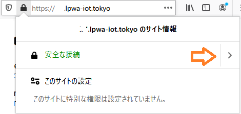
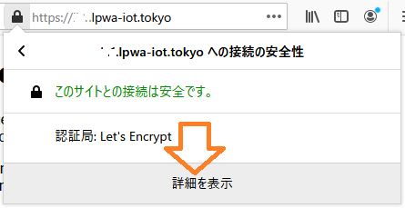
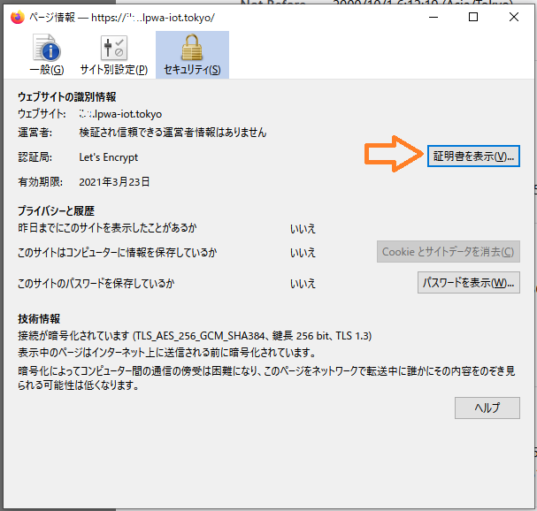
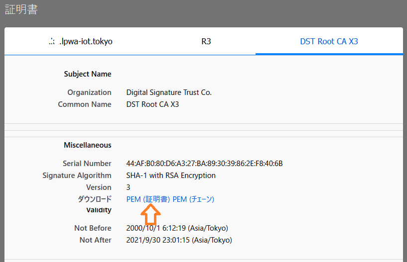
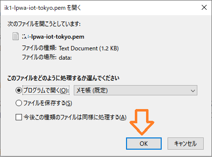

# LTE-Mリーフ 利用ガイド(HTTPライブラリ)

## HTTPライブラリ

### 利用できる機能
このライブラリはHTTPサーバーに対して次のような通信を行うことができます  
・HTTPおよびHTTPS通信  
・GET,POST,PUT,DELTEメソッド  
・HTTPリクエストヘッダ設定  

#### 制限事項
リリース時点のLPWAモデムは次のような制限事項がありますの注意してください  
・リクエストヘッダのAuthorization がBASIC認証(Basic OG==)に固定されている  
・HTTPレスポンスボディが分割された場合は先頭のみ受信される  

### サンプルスケッチ
ArduinoIDEの次の場所にサンプルスケッチがインストールされていますので参考にしてください  
[スケッチ例]->[stp32lpwa]->[LPWA]  
・HttpGet -- GETメソッド  
・HttpPost -- POSTメソッド  
・HttpPut -- PUTメソッド  
・HttpDelete -- DELETEメソッド  


### HTTP通信
ライブラリを用いてHTTP通信を行う方法を説明します  
まず LpwaHttpClientクラスを初期化し接続先とポート番号を設定します
```
char serverAddress[] = "postman-echo.com"; // server address
int port = 80;
LpwaHttpClient client = LpwaHttpClient(serverAddress, port);

```

#### GETメソッド
GETメソッドを使う場合はget()を使用します  
引数にはアクセスしたいURIを設定してください  
戻り値は成功時はHTTPレスポンスコード、HTTP通信に失敗した場合は-1が返ります  
```
int resp = client.get("/get");
```
HTTP通信のレスポンスコードとレスポンスボディは次のようにして取得します  
```
int statusCode = client.responseStatusCode();
String response = client.responseBody();
```
#### POSTメソッド
POSTメソッドを使う場合はpost()を使用します  
引数にはアクセスしたいURI,contentType,dataを設定してください  
戻り値は成功時はHTTPレスポンスコード、HTTP通信に失敗した場合は-1が返ります  
```
String contentType = "application/x-www-form-urlencoded";
String postData = "data=PostData&value=123";
int resp = client.post("/post", contentType, postData);
```

HTTP通信のレスポンスコードとレスポンスボディは次のようにして取得します  
```
int statusCode = client.responseStatusCode();
String response = client.responseBody();
```

#### PUT メソッド
PUTメソッドを使う場合はput()を使用します  
引数にはアクセスしたいURI,contentType,dataを設定してください  
戻り値は成功時はHTTPレスポンスコード、HTTP通信に失敗した場合は-1が返ります  
```
String contentType = "application/x-www-form-urlencoded";
String putData = "data=PostData&value=123";
int resp = client.put("/put", contentType, putData);
```

HTTP通信のレスポンスコードとレスポンスボディは次のようにして取得します  
```
int statusCode = client.responseStatusCode();
String response = client.responseBody();
```

#### DELETE メソッド
DELETEメソッドを使う場合はdel()を使用します  
引数にはアクセスしたいURIを設定してください  
戻り値は成功時はHTTPレスポンスコード、HTTP通信に失敗した場合は-1が返ります  
```
int resp = client.del("/delete");
```

HTTP通信のレスポンスコードとレスポンスボディは次のようにして取得します  
```
int statusCode = client.responseStatusCode();
String response = client.responseBody();
```


#### リクエストヘッダ
HTTPの各メソッドにてリクエスト時にヘッダを付与することができます  
まず設定済みのヘッダをクリアしてから付与したいヘッダ文字列を設定します  
次のコードは全てのコンテント種別を許可する例です  
```
  client.clrHeader();
  client.addHeader("Accept", "*/*");
```


### HTTPS通信
HTTPSを使う場合は接続先サイトの証明書(ROOT CA)が必要となります  
ここではpostman-echo.comとHTTPS接続する例を記載します  

まず opensslコマンドでSSL証明書を取得します

```
$ openssl s_client -connect postman-echo.com:443 -showcerts
...
 1 s:C = US, O = Amazon, OU = Server CA 1B, CN = Amazon
   i:C = US, O = Amazon, CN = Amazon Root CA 1
-----BEGIN CERTIFICATE-----
MIIESTCCAzGgAwIBAgITBn+UV4WH6Kx33rJTMlu8mYtWDTANBgkqhkiG9w0BAQsF
ADA5MQswCQYDVQQGEwJVUzEPMA0GA1UEChMGQW1hem9uMRkwFwYDVQQDExBBbWF6
b24gUm9vdCBDQSAxMB4XDTE1MTAyMjAwMDAwMFoXDTI1MTAxOTAwMDAwMFowRjEL
MAkGA1UEBhMCVVMxDzANBgNVBAoTBkFtYXpvbjEVMBMGA1UECxMMU2VydmVyIENB
IDFCMQ8wDQYDVQQDEwZBbWF6b24wggEiMA0GCSqGSIb3DQEBAQUAA4IBDwAwggEK
AoIBAQDCThZn3c68asg3Wuw6MLAd5tES6BIoSMzoKcG5blPVo+sDORrMd4f2AbnZ
cMzPa43j4wNxhplty6aUKk4T1qe9BOwKFjwK6zmxxLVYo7bHViXsPlJ6qOMpFge5
blDP+18x+B26A0piiQOuPkfyDyeR4xQghfj66Yo19V+emU3nazfvpFA+ROz6WoVm
B5x+F2pV8xeKNR7u6azDdU5YVX1TawprmxRC1+WsAYmz6qP+z8ArDITC2FMVy2fw
0IjKOtEXc/VfmtTFch5+AfGYMGMqqvJ6LcXiAhqG5TI+Dr0RtM88k+8XUBCeQ8IG
KuANaL7TiItKZYxK1MMuTJtV9IblAgMBAAGjggE7MIIBNzASBgNVHRMBAf8ECDAG
AQH/AgEAMA4GA1UdDwEB/wQEAwIBhjAdBgNVHQ4EFgQUWaRmBlKge5WSPKOUByeW
dFv5PdAwHwYDVR0jBBgwFoAUhBjMhTTsvAyUlC4IWZzHshBOCggwewYIKwYBBQUH
AQEEbzBtMC8GCCsGAQUFBzABhiNodHRwOi8vb2NzcC5yb290Y2ExLmFtYXpvbnRy
dXN0LmNvbTA6BggrBgEFBQcwAoYuaHR0cDovL2NydC5yb290Y2ExLmFtYXpvbnRy
dXN0LmNvbS9yb290Y2ExLmNlcjA/BgNVHR8EODA2MDSgMqAwhi5odHRwOi8vY3Js
LnJvb3RjYTEuYW1hem9udHJ1c3QuY29tL3Jvb3RjYTEuY3JsMBMGA1UdIAQMMAow
CAYGZ4EMAQIBMA0GCSqGSIb3DQEBCwUAA4IBAQCFkr41u3nPo4FCHOTjY3NTOVI1
59Gt/a6ZiqyJEi+752+a1U5y6iAwYfmXss2lJwJFqMp2PphKg5625kXg8kP2CN5t
6G7bMQcT8C8xDZNtYTd7WPD8UZiRKAJPBXa30/AbwuZe0GaFEQ8ugcYQgSn+IGBI
8/LwhBNTZTUVEWuCUUBVV18YtbAiPq3yXqMB48Oz+ctBWuZSkbvkNodPLamkB2g1
upRyzQ7qDn1X8nn8N8V7YJ6y68AtkHcNSRAnpTitxBKjtKPISLMVCx7i4hncxHZS
yLyKQXhw2W2Xs0qLeC1etA+jTGDK4UfLeC0SF7FSi8o5LL21L8IzApar2pR/
-----END CERTIFICATE-----
...
```

取得できたデータ列のうち "CN = * Root CA * " のCertificate chainを文字列としてスケッチ内に記述します
```
// ルート証明書
// 対象となるサイトからpemファイルをダウンロードしソースコードに展開する
const char* root_ca = \
                          "-----BEGIN CERTIFICATE-----\n" \
                          "MIIESTCCAzGgAwIBAgITBn+UV4WH6Kx33rJTMlu8mYtWDTANBgkqhkiG9w0BAQsF\n" \
                          "ADA5MQswCQYDVQQGEwJVUzEPMA0GA1UEChMGQW1hem9uMRkwFwYDVQQDExBBbWF6\n" \
                          "b24gUm9vdCBDQSAxMB4XDTE1MTAyMjAwMDAwMFoXDTI1MTAxOTAwMDAwMFowRjEL\n" \
                          "MAkGA1UEBhMCVVMxDzANBgNVBAoTBkFtYXpvbjEVMBMGA1UECxMMU2VydmVyIENB\n" \
                          "IDFCMQ8wDQYDVQQDEwZBbWF6b24wggEiMA0GCSqGSIb3DQEBAQUAA4IBDwAwggEK\n" \
                          "AoIBAQDCThZn3c68asg3Wuw6MLAd5tES6BIoSMzoKcG5blPVo+sDORrMd4f2AbnZ\n" \
                          "cMzPa43j4wNxhplty6aUKk4T1qe9BOwKFjwK6zmxxLVYo7bHViXsPlJ6qOMpFge5\n" \
                          "blDP+18x+B26A0piiQOuPkfyDyeR4xQghfj66Yo19V+emU3nazfvpFA+ROz6WoVm\n" \
                          "B5x+F2pV8xeKNR7u6azDdU5YVX1TawprmxRC1+WsAYmz6qP+z8ArDITC2FMVy2fw\n" \
                          "0IjKOtEXc/VfmtTFch5+AfGYMGMqqvJ6LcXiAhqG5TI+Dr0RtM88k+8XUBCeQ8IG\n" \
                          "KuANaL7TiItKZYxK1MMuTJtV9IblAgMBAAGjggE7MIIBNzASBgNVHRMBAf8ECDAG\n" \
                          "AQH/AgEAMA4GA1UdDwEB/wQEAwIBhjAdBgNVHQ4EFgQUWaRmBlKge5WSPKOUByeW\n" \
                          "dFv5PdAwHwYDVR0jBBgwFoAUhBjMhTTsvAyUlC4IWZzHshBOCggwewYIKwYBBQUH\n" \
                          "AQEEbzBtMC8GCCsGAQUFBzABhiNodHRwOi8vb2NzcC5yb290Y2ExLmFtYXpvbnRy\n" \
                          "dXN0LmNvbTA6BggrBgEFBQcwAoYuaHR0cDovL2NydC5yb290Y2ExLmFtYXpvbnRy\n" \
                          "dXN0LmNvbS9yb290Y2ExLmNlcjA/BgNVHR8EODA2MDSgMqAwhi5odHRwOi8vY3Js\n" \
                          "LnJvb3RjYTEuYW1hem9udHJ1c3QuY29tL3Jvb3RjYTEuY3JsMBMGA1UdIAQMMAow\n" \
                          "CAYGZ4EMAQIBMA0GCSqGSIb3DQEBCwUAA4IBAQCFkr41u3nPo4FCHOTjY3NTOVI1\n" \
                          "59Gt/a6ZiqyJEi+752+a1U5y6iAwYfmXss2lJwJFqMp2PphKg5625kXg8kP2CN5t\n" \
                          "6G7bMQcT8C8xDZNtYTd7WPD8UZiRKAJPBXa30/AbwuZe0GaFEQ8ugcYQgSn+IGBI\n" \
                          "8/LwhBNTZTUVEWuCUUBVV18YtbAiPq3yXqMB48Oz+ctBWuZSkbvkNodPLamkB2g1\n" \
                          "upRyzQ7qDn1X8nn8N8V7YJ6y68AtkHcNSRAnpTitxBKjtKPISLMVCx7i4hncxHZS\n" \
                          "yLyKQXhw2W2Xs0qLeC1etA+jTGDK4UfLeC0SF7FSi8o5LL21L8IzApar2pR/\n" \
                          "-----END CERTIFICATE-----\n";

```

ライブラリに接続先、ポート番号(443)、証明書を設定します  

```
char serverAddress[] = "postman-echo.com"; // server address
int port = 443;
LpwaHttpClient client = LpwaHttpClient(serverAddress, port, true);
client.setCert(root_ca);

```
あとはHTTP動作と同様にGET,POSTなどのメソッドを利用可能です

#### <参考> ブラウザを用いた証明書の取得方法について
前項で紹介しましたHTTPS用の証明書(ROOT CA)についてお手元の環境で SSLコマンドが利用できない場合はブラウザ(firefox)でも取得することができます。

Firefoxで対象のURLを開き鍵マークをクリックします  
プルダウンしてきた画面の中で矢印の部分をクリック  


下の部分にある「詳細を表示」をクリック  


ページ情報画面がポップアップしますので「証明書を表示」ボタンをクリックします  


ブラウザ画面に証明書が表示されますので右側のタブ(ここではDST Root CA X3)を選びます  
画面を下にスクロールするとダウンロードの項目にPEM(証明書)のリンクがありますのでクリックします  


ファイルのダウンロード画面が出たらメモ帳を選択してOKを押してください  


メモ帳にある内容を前項の説明と同じようにソースコードに張り付けてください  

