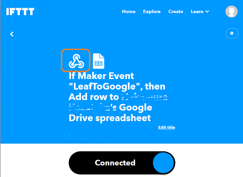
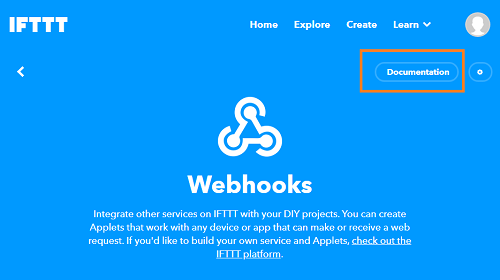
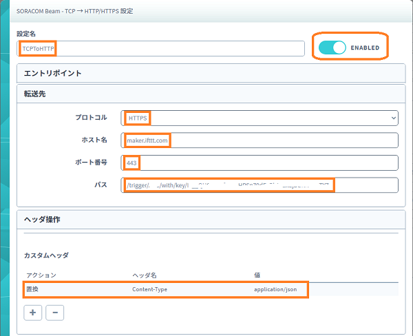

# LTE-Mリーフ 活用ガイド(SoracomSensorDemo2)

LTE-Mリーフを使ってSORACOM クラウド(バイナリパーサー)へ送信し、beamからIFTTTを経由してGoogleスプレッドシートに書き込む方法を紹介いたします  

## データの流れ

## SORACOMクラウドを使うメリット
・閉域網によるセキュアな接続  
外部との接続が閉じたネットワーク間でクラウドまで接続できますので暗号化が不要になります  

・バイナリ送信  
通常のクラウド通信では文字列を用いたデータ構造を使うことが多く1要素のデータを送るだけでも１０バイト近いデータは必要になります  
バイナリパーサーを使用することにより最小限のデータ量に抑えることができます  

→ SSL通信によるオーバーヘッド＋文字列によるデータ量増加を抑えることができる  
これらのことから通信費を低く抑えることができ大量のデバイスを用いるIoTには最適です  
　  
LTE-Mリーフ (温度センサー)  
　|  
　| TCP/UDP  
　|  
SORACOMクラウド(バイナリパーサー)  
SORACOMクラウド(beam)  
　|  
　| HTTPS  
　|  
IFTTT(Webhooks)  
IFTTT(google)  
　|  
Googleスプレッドシート  

## ソースコード  
SoracomSensorDemo2フォルダをPCにコピーしArudino IDEで開きます

## IFTTT設定
設定前に予めIFTTTのアカウントを作成しておいてください
googleアカウントを使うとスプレッドシートまでの接続が楽になりますのでgoogleアカウントでの作成を推奨します  

IFTTT URL: https://ifttt.com

### IFTTT アプレットの作成
今回はwebhookをトリガー(This)にGooggle Sheetをアクション(That)に設定します  

home画面にて一番上にあるCreateをクリックします  


トリガー選択を促す画面が出ますので[If This]ボタンを押します  


トリガーのサービス検索画面が出ます  
検索窓に"webhooks"と入力しますと[Webhooks]アイコンが出ますのでクリックで選択  


トリガー要因の選択画面が出ますので"Receive a web request"を選択します  


webhooksのイベント名入力画面が出ますのでEvent Name のところに任意の名称を入力します  
ここでは"LeafToGoogle"と入力しました  
この名称はSORACOMクラウドの設定で使いますのでメモしておいてください  


次はアクション(That)です
アクション選択を促す画面が出ますので[Then That]ボタンを押します  


アクションのサービス検索画面が出ます  
検索窓に"google"と入力しますと[Google Sheets]アイコンが出ますのでクリックで選択 


google sheetのアクション設定選択が出ますので[add]もしくは[Update]を選択します  
今回はシートに順次追記を行いますので[add]を選択しています  


シートの名称、フォーマット、フォルダパスの設定画面となりますので好みで設定してください  
ここではシート名"IFTTT_Leaf_Sensor"、フォルダパスは"IFTTT"としています  


トリガーとアクションの入力が終わりましたので[Continue]ボタンを押します  


設定内容の確認画面が出ますので[Finish]ボタンをおしてアプレット入力を完了させます  


Webhooksの設定確認を行うためにWebhookのアイコンを押します  


Webhooksの設定画面が出ますので[Documentation]ボタンを押します  


webhooksのパラメータ画面が出ます  
オレンジ色で囲まれた文字列はアプレットのアクセスキーになりますのでメモしておいてください  
このアクセスキーはSORACOMクラウド設定にて使用します  


この画面ではwebhooksのトリガーを発行し動作テストすることができます  
オレンジ色で囲まれた部分を入力して[Test It]ボタンを押してください  


[Test It]を押した後googleドライブを開きIFTTTフォルダ内にシートが作られていることを確認しましょう  
次のようなデータが書き込まれたシートがあればIFTTTの設定は成功です  


## SORACOMクラウド設定
本デモを実行する前に次の設定を行って下さい  
・SORACOMクラウドへのログイン  
・SIMグループの選択  
・バイナリパーサー,Harvest Dataの設定  

### SORACOMクラウドへのログイン  
SIM管理用アカウントを使ってSORACOMクラウドにログインします  

https://console.soracom.io/


### SIMグループの選択
SIM登録画面にて登録したSIMグループ名リンクをクリックします  


SIMグループの設定画面に移動します  


### バイナリパーサー,Harvest Dataの設定
SIMグループの設定画面にて次の設定を行います  

#### バイナリパーサー  
LTE-Mリーフから送信されるデータはバイナリ形式で次のようになっています  
　バイト[0],[1] -- 温度(x100)  
　バイト[2],[3] -- 湿度(x10)  
　バイト[4],[5] -- 気圧(x1)  
バイナリパーサを用いて利用可能なデータ形式に変換する設定を行います。  
ここでは温度値、湿度、気圧を数値へ変換する式を設定しています
```
value1:0:uint:16:/100 value2:2:uint:16:/10 value3:4:uint:16:
```


#### beam設定
IFTTTへデータを転送するための設定を行います  
LTE-MリーフからのデータはTCPデータで転送先はHTTPSになりますので次のような設定になります  
設定名： TCPtoHTTP  
プロトコル： HTTPS  
ホスト名： maker.ifttt.com  
ポート番号： 443  
パス：/trigger/{Event Name}/with/key/{アクセスキー}  
{Event Name},{アクセスキー}はIFTTTのwebhooks設定の際にメモした文字列を入れます  


## スケッチの実行とグラフ表示
サンプルスケッチをLTE-Mリーフに書き込みます  
成功すればシリアルモニタに次のようなログが出ているはずです  
```
Starting SORACOM demo.
....
LPWA connected
@@@@ loop() start
Temp: 2188
Humidity: 530
Pressure: 648
@@@@@ soracom_send_tcp(TCP):
<info>TCP CONNECT_OK
TCP connected
TCP send OK

```

googleスプレッドシートを開くと温度、湿度、気圧の値が書き込まれていれば成功です  


<div style="text-align: right;">
COPYRIGHT© 2020,2021 KDDI CORPORATION, ALL RIGHTS RESERVED.
</div>
