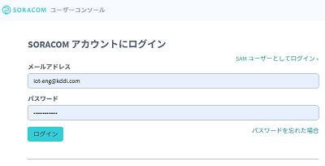
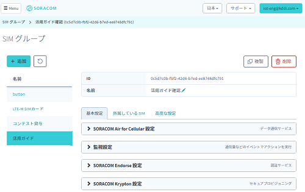

# LTE-Mリーフ 活用ガイド(SoracomSensorDemo1)

LTE-Mリーフを使ってSORACOM クラウド(バイナリパーサー)へ送信し、harvestでグラフ表示する方法を紹介いたします  

## データの流れ

## SORACOMクラウドを使うメリット
・閉域網によるセキュアな接続  
外部との接続が閉じたネットワーク間でクラウドまで接続できますので暗号化が不要になります  

・バイナリ送信  
通常のクラウド通信では文字列を用いたデータ構造を使うことが多く1要素のデータを送るだけでも１０バイト近いデータは必要になります  
バイナリパーサーを使用することにより最小限のデータ量に抑えることができます  

→ SSL通信によるオーバーヘッド＋文字列によるデータ量増加を抑えることができる  
これらのことから通信費を低く抑えることができ大量のデバイスを用いるIoTには最適です  
　  
LTE-Mリーフ (温度センサー)  
　|  
　| TCP/UDP  
　|  
SORACOMクラウド(バイナリパーサー)  
　|  
SORACOMクラウド(Harvest Data)  
　|  
　| HTTPS  
　|  
ブラウザ[グラフ表示]  


## ソースコード  
SoracomSensorDemo1フォルダをPCにコピーしArudino IDEで開きます

## SORACOMクラウド設定
本デモを実行する前に次の設定を行って下さい  
・SORACOMクラウドへのログイン  
・SIMグループの選択  
・バイナリパーサー,Harvest Dataの設定  

### SORACOMクラウドへのログイン  
SIM管理用アカウントを使ってSORACOMクラウドにログインします  

https://console.soracom.io/




### SIMグループの選択
SIM登録画面にて登録したSIMグループ名リンクをクリックします  


SIMグループの設定画面に移動します  


### バイナリパーサー,Harvest Dataの設定
SIMグループの設定画面にて次の設定を行います  

#### バイナリパーサー  
LTE-Mリーフから送信されるデータはバイナリ形式で次のようになっています  
　バイト[0],[1] -- 温度(x100)  
　バイト[2],[3] -- 湿度(x10)  
　バイト[4],[5] -- 気圧(x1)  
バイナリパーサを用いて利用可能なデータ形式に変換する設定を行います。  
ここでは温度値をtempに変換する式を設定しています
```
temp:0:uint:16:/100
```
#### Harvest Data
機能を有効にするため設定をONにします  


## スケッチの実行とグラフ表示
サンプルスケッチをLTE-Mリーフに書き込みます  
成功すればシリアルモニタに次のようなログが出ているはずです  
```
Starting SORACOM demo.
....
LPWA connected
@@@@ loop() start
Temp: 2188
Humidity: 530
Pressure: 648
@@@@@ soracom_send_tcp(TCP):
<info>TCP CONNECT_OK
TCP connected
TCP send OK

```

SIM管理画面からSIMのチェックを入れ右クリックで「データ確認」を選択します  


グラフ選択画面が出ますので「検索」ボタンを押します  


自動更新スイッチをオンにすると継続してグラフ表示が行われます    


<div style="text-align: right;">
COPYRIGHT© 2020,2021 KDDI CORPORATION, ALL RIGHTS RESERVED.
</div>
