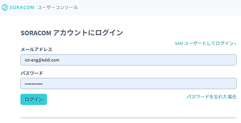
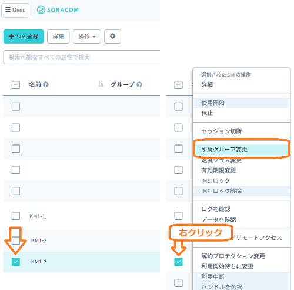
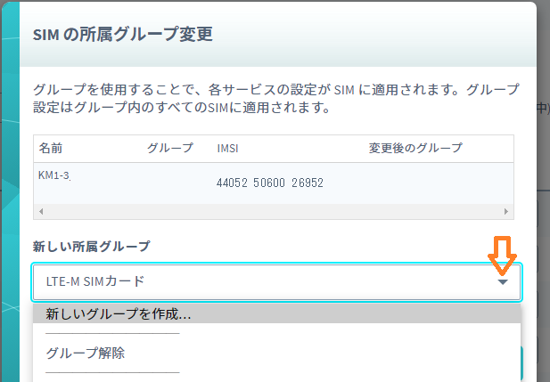
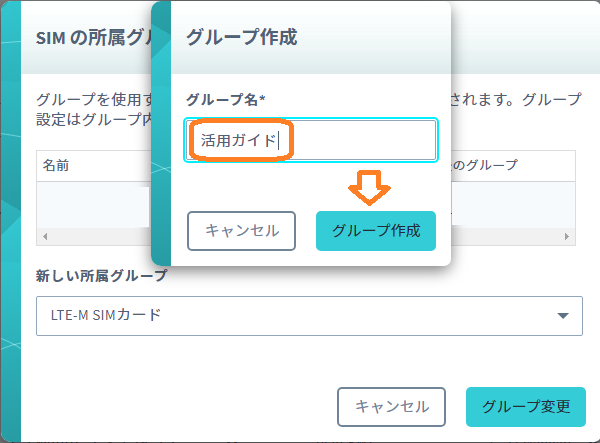
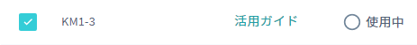

# LTE-Mリーフ 活用ガイド(SORACOMクラウド)

LTE-Mリーフを使ってSORACOMクラウドにデータ転送、可視化を行う方法を紹介いたします  

## サンプルコード、設定ガイド
以下のページにサンプルコードと設定例がありますので参考にしてください。  
サンプルコードを実行する前には必ず次項の「SORACOMクラウド設定」を行ってください

・SORACOM バイナリパーサーへ送信し、harvestでグラフ表示  
　https://github.com/mi-saitou/LTE-M-Leaf/blob/main/soracom/HarvestData/README.md  

・SORACOM バイナリパーサーへ送信し、IFTTT経由でgoogleスプレッドシートに送信  
　https://github.com/mi-saitou/LTE-M-Leaf/blob/main/soracom/beam/README.md  

## SORACOMクラウド設定

SORACOMクラウドを利用するにはまず次の手順を行って下さい  
・SORACOMクラウドへのログイン  
・SIMの所属グループ設定

### SORACOMクラウドへのログイン
SIM管理用アカウントを使ってSORACOMクラウドにログインします  

https://console.soracom.io/

管理用アカウントを受領していない場合はLTE-Mリーフ配布元にお問い合わせください

### SIMの所属グループ設定
LTE-Mリーフに取り付けてあるSIMに対して所属グループ登録と設定を行います  
SORACOMクラウドにログイン後はSIM登録画面になっているはずです  
もしSIM登録画面が表示されていない場合は左上の「＋SIM登録」ボタンを押してください  

次に右側に並んでいるSIMのリストからお手元のSIM番号のチェックボタンをセットし  
右クリック→所属グループ変更を選択します  

SIMの所属グループ変更画面が出ますので新しい所属グループのところにある▼マークを押して  
「新しいグループを作成...」を選択します  

グループ作成画面が出たら任意の名前を入力し「グループ作成」ボタンを押します  
ここでは「活用ガイド」という名前を入力する例を示します  

SIMのグループ名が設定した名前になれば登録完了です  

COPYRIGHT© 2020,2021 KDDI CORPORATION, ALL RIGHTS RESERVED.

